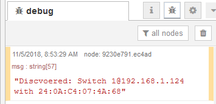
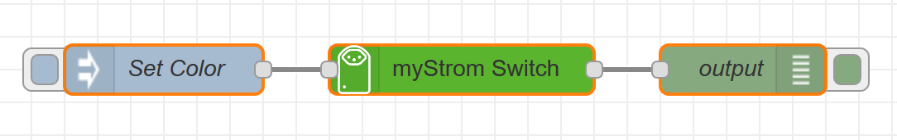
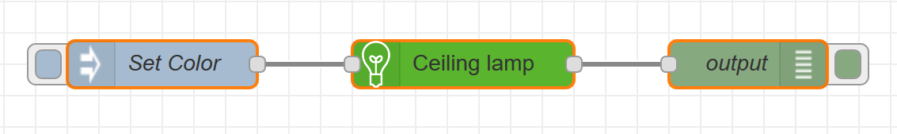
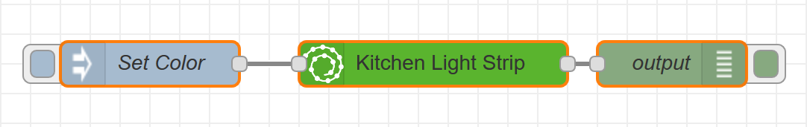
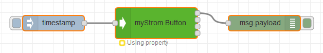
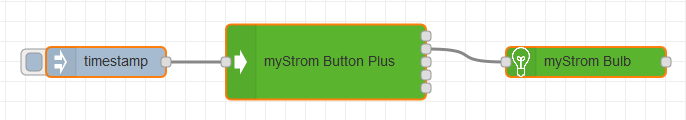

   

### Features

- Control nodes via JSON input flows or by simply setting the values in the properties menu
- [Automatic discovery of myStrom devices](#automatic-device-discovery)
- Full functionality of the myStrom api
- Status message of how the message was sent
- Status if message has arrived at destination (TODO)
- Graphical color picker for lights (TODO)

### Installation

#### Installation on Node-RED

myStrom-Node-RED was written in **Node.js** v4.2.6 and tested on Node-RED v0.19.4.

To use it execute `npm install node-red-contrib-mystrom` or use the node-RED interface by accessing Node-RED web ui -> top right menu -> "manage palette"->"install"-> serach for "node-red-contrib-mystrom"

### Bugs

Please report all bugs through the Github issues page. Your help is greatly appreciated.

### Execution (IMPORTANT!!!)

All devices can be controlled in two ways.

1.  Give a valid JSON payload as input. What is needed for a valid input can be seen under Usage.
2.  By specifing the wished function with via the property editor. This is the easier option and is recommended for newer users. _If this option is chosen you can disregard the Usage section_

If both options are available i.e. (a valid JSON gets sent as input to a myStrom node which was already been setup with the property editor) the JSON input will be executed. This means **JSON takes precedence over the property editor**.

Also make sure that you can listen on port 7979 on your node-red host since otherwise the automatic device discovery will not work.

### Automatic Device discovery

**This will only work once at least one myStrom node is deployed.**

Device on your network are automatically discovered on start up. You will see a warning message for each discovered device in your debug panel. Fear not this is not an actual warning but rather an information for the user. The devices detected can be selected in the dropdown menus when specifying which device to use through the property editor of a myStrom node.

Note: Buttons will only be discovered in configuration mode. See the section [Buttons](#buttons) for further info.

### Nodes

- [myStrom Switch](#mystrom-switch)
- [myStrom Bulb](#mystrom-bulb)
- [myStrom Light Strip](#mystrom-light-strip)
- [myStrom Button](#mystrom-button)
- [myStrom Button+](#mystrom-buttonplus)

### Usage

Every request has to contain the following:

| Attribute   | Type                            | Description                                    |
| :---------- | :------------------------------ | :--------------------------------------------- |
| **ip**      | string                          | IP address of the myStrom Device               |
| **mac**     | string                          | MAC address of the myStrom Device              |
| **request** | enum[ see list for each device] | Request we want to execute                     |
| data        | array                           | Parameter used to further specify the request. |

The elements which are valid options for the request field are specified per-device and can be found below.

#### myStrom Switch

Change the state of the switch, get the room temperature or get diagnostic info about the switch.

| Valid requests | Type   | Description                     |
| :------------- | :----- | :------------------------------ |
| `on`           | string | Turns the switch on             |
| `off`          | string | Turns the switch off            |
| `toggle`       | string | toggles the switch              |
| `report`       | string | Get diagnostic information      |
| `temp`         | string | Get room temperature in celsius |

##### Examples

To turn the switch on:

      { "ip": "192.168.1.00",
        "mac": "00:00:00:00:00:00"
        "request":  "on"
      }

To turn the switch off:

    { "ip": "192.168.1.00",
      "mac": "00:00:00:00:00:00"
      "request":  "off"
    }

The api documentatino of the switch can be found [here.](https://mystrom.ch/wp-content/uploads/REST_API_WSE.txt "myStrom Switch documentation")

#### myStrom Bulb

Change the state of the bulb, change the colour and set the speed (ramp) of the transition

| Valid requests | Type   | Description                                                |
| :------------- | :----- | :--------------------------------------------------------- |
| `on`           | string | Turns the bulb on                                          |
| `off`          | string | Turns the bulb off                                         |
| `toggle`       | string | toggles the bulb                                           |
| `report`       | string | Get diagnostic information                                 |
| `color`        | string | _Needs additional data array_. See below for specification |

| Valid data | Type   | Need for request | Format                                      | Description                                                                                    |
| :--------- | :----- | :--------------- | :------------------------------------------ | :--------------------------------------------------------------------------------------------- |
| `color`    | string | `color`          | Must be in RGBW format and start with a '#' | Specifies the color which the bulb should be set to. Only used if the request is set to color. |
| `ramp`     | int    | `color`          | Must be a positive number.                  | Specify the transition time in miliseconds.                                                    |

##### Examples:

To turn the bulb on:

    { "ip": "192.168.1.00",
      "mac": "00:00:00:00:00:00"
      "request":  "on"
    }

To turn the bulb red with a slow transition:

    { "ip": "192.168.1.00",
      "mac": "00:00:00:00:00:00"
      "request":  "color",
      "data": {
        "color": "#ff000000",
        "ramp": "1000"
      }
    }

The api documentatino of the bulb can be found [here.](https://mystrom.ch/wp-content/uploads/REST_API_WRB-2.txt "myStrom Bulb")

#### myStrom Light Strip

Change the state of the light strip, change the colour and set the speed (ramp) of the transition

| Valid requests | Type   | Description                                                |
| :------------- | :----- | :--------------------------------------------------------- |
| `on`           | string | Turns the light strip on                                   |
| `off`          | string | Turns the light strip off                                  |
| `toggle`       | string | toggles the light strip                                    |
| `report`       | string | Get diagnostic information                                 |
| `color`        | string | _Needs additional data array_. See below for specification |

| Valid data | Type   | Need for request | Format                                        | Description                                                            |
| :--------- | :----- | :--------------- | :-------------------------------------------- | :--------------------------------------------------------------------- |
| `color`    | string | `color`          | Must be in RGBW format and start with a '#'   | Specifies the color which the light strip should be set to.            |
| `ramp`     | int    | `color`          | Must be a positive number between 0 and 1000. | Specifies the time it takes to transition to new color in miliseconds. |

##### Examples:

To turn the light strip on:

    { "ip": "192.168.1.00",
      "mac": "00:00:00:00:00:00"
      "request":  "on"
    }

To turn the light strip red with a slow transition:

    { "ip": "192.168.1.00",
      "mac": "00:00:00:00:00:00"
      "request":  "color",
      "data": {
        "color": "#ff000000",
        "ramp": "1000"
      }
    }

The api documentatino of the light strip can be found [here.](https://mystrom.ch/wp-content/uploads/REST_API_WRS-1.txt "myStrom light strip")

### Buttons

##### Configuring Buttons

Everytime the settings of the button have been changed they need to be upladed to the button:

- (Easy) property mode: Simply give the button anything as input (e.g. inject a timestamp) and it will upload the data specified in the property of the node to the button.
- JSON mode: Give a valid JSON object with the correct properties as input. See examples.

In order to be able to upload data to the button the button has to be in configuration mode **otherwise it will not work**. Note that the buttons will only stay in configuration mode for a few minutes. You get into the configuration mode as follows:

- _Button_: Charging it for a few seconds, detaching in and pressing the it
- _Button+_: Remove the battery and insert it again. The battery can be accessed by rotating the base of the button (the one with 4 small magnets on it).

You can check that the button is in configuration mode by checking if the device has popped up as [discovered](#automatic-device-discovery).

Once the buttons have been configured you do not need to re-upload to the button everytime you have attached things to the button node outputs. Only when you change things in the actual node property you will have to upload it again.

##### Using button node outputs

If the address of a button action is set to 'wire' the outputs of the button node will output the message 'success'. The first node output however is always reserved for the 'report' action. This means that, if the 'Single click' address is set to 'wire', the second output will get the message 'success'. For 'Double click' the third output will get it, for 'Long click' the forth and for 'Touch' the fifth.

#### myStrom Button

Set the address to which the button should send a request for each button click or use the button click as input into node-RED.

| Valid requests | Type   | Description                                                                                   |
| :------------- | :----- | :-------------------------------------------------------------------------------------------- |
| `set`          | string | Set the addresses the button should send requests to (Button has to be in configuration mode) |
| `report`       | string | Gets info from the button. (Button has to be in configuration mode)                           |

| Valid data | Type  | For request      | Format                 | Description                                                       |
| :--------- | :---- | :--------------- | :--------------------- | :---------------------------------------------------------------- |
| `single`   | array | `set` (optional) | See Valid action below | Specifies the url and data the button should send the request to. |
| `double`   | array | `set` (optional) | See Valid action below | Specifies the url and data the button should send the request to. |
| `long`     | array | `set` (optional) | See Valid action below | Specifies the url and data the button should send the request to. |

Not all of these parameters have to be specified all the time. You can have 1 or all of them. It does not matter.

| Valid action | Type   | Needed for data                             | Format                                    | Description                                                    |
| :----------- | :----- | :------------------------------------------ | :---------------------------------------- | :------------------------------------------------------------- |
| `url`        | string | `single`,`double`,`long`,`touch`            | < ip address > or < ip address >:< port > | Specifies the url and port to which the request should be sent |
| `url-data`   | string | `single`,`double`,`long`,`touch` (optional) | key1=value1&key2=value2&...               | Specifies the data that should be sent to the address          |

##### Examples:

Set single click to wire output, send get request to google.com with double click and send post request to 192.168.1.2 on port 9000 with data foo1=bar1&foo2=bar2 on long click:

    {
      "ip": "192.168.1.122",
      "mac": "5C:CF:7F:CB:A9:AA",
      "request": "set",
      "data": {
        "single": {
          "url": "wire",
          "url-data": ""
        },
        "double": {
          "url": "wire",
          "url-data": ""
        },
        "long": {
          "url": "192.168.1.2:9000",
          "url-data": "foo1=bar1&foo2=bar2"
        }
      }
    }

The api documentatino of the Button+ can be found [here.](https://mystrom.ch/wp-content/uploads/REST_API_WBP-4.txt "myStrom Button strip")

#### myStrom Button +

Set the address to which the button should send a request for each button click or use the button click as input into node-RED.

| Valid requests | Type   | Description                                                         |
| :------------- | :----- | :------------------------------------------------------------------ |
| `set`          | string | Set the addresses the button should send requests to                |
| `report`       | string | Gets info from the button. (Button has to be in configuration mode) |

| Valid data | Type  | For request      | Format                 | Description                                                       |
| :--------- | :---- | :--------------- | :--------------------- | :---------------------------------------------------------------- |
| `single`   | array | `set` (optional) | See Valid action below | Specifies the url and data the button should send the request to. |
| `double`   | array | `set` (optional) | See Valid action below | Specifies the url and data the button should send the request to. |
| `long`     | array | `set` (optional) | See Valid action below | Specifies the url and data the button should send the request to. |
| `touch`    | array | `set` (optional) | See Valid action below | Specifies the url and data the button should send the request to. |

Not all of these parameters have to be specified all the time. You can have 1 or all of them. It does not matter.

| Valid action | Type   | Needed for data                             | Format                                    | Description                                                    |
| :----------- | :----- | :------------------------------------------ | :---------------------------------------- | :------------------------------------------------------------- |
| `url`        | string | `single`,`double`,`long`,`touch`            | < ip address > or < ip address >:< port > | Specifies the url and port to which the request should be sent |
| `url-data`   | string | `single`,`double`,`long`,`touch` (optional) | key1=value1&key2=value2&...               | Specifies the data that should be sent to the address          |

##### Examples:

Set single and double click to wire output, send get request to google.com with long click and send post request to 192.168.1.2 on port 9000 with data foo1=bar1&foo2=bar2 on touch:

    {
      "ip": "192.168.1.122",
      "mac": "5C:CF:7F:CB:A9:AA",
      "request": "set",
      "data": {
        "single": {
          "url": "wire",
          "url-data": ""
        },
        "double": {
          "url": "wire",
          "url-data": ""
        },
        "long": {
          "url": "https://google.com",
          "url-data": ""
        },
        "touch": {
          "url": "192.168.1.2:9000",
          "url-data": "foo1=bar1&foo2=bar2"
        }
      }
    }

The api documentatino of the Button+ can be found [here.](https://mystrom.ch/wp-content/uploads/REST_API_WBS.txt "myStrom Button+")
